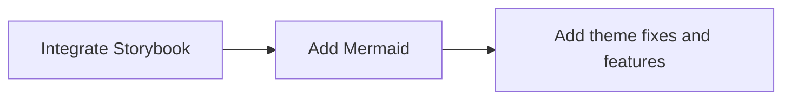

import { Meta } from '@storybook/addon-docs';
import { Prism as SyntaxHighlighter } from 'react-syntax-highlighter';

<Meta title="Search Indexing" />

# SCSS example

This is a sample SCSS code block example highlighted in Storybook

```sass
$font-stack: Helvetica, sans-serif;
$primary-color: #333;

body {
  font: 100% $font-stack;
  color: $primary-color;
}
```

# Mermaid integration


